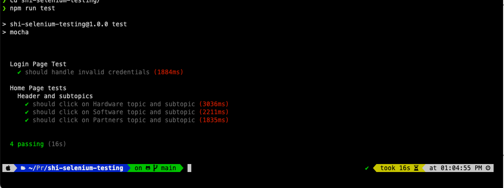

# shi-selenium-testing

## Getting Started

You need to install either [Yarn](https://yarnpkg.com/en/) or [Node](https://nodejs.org/en/) on your machine. In this project, I will use NPM for installing packages and running scripts.

```sh
npm install
```

## Running UI Test

```sh
npm run test
```

## Images



